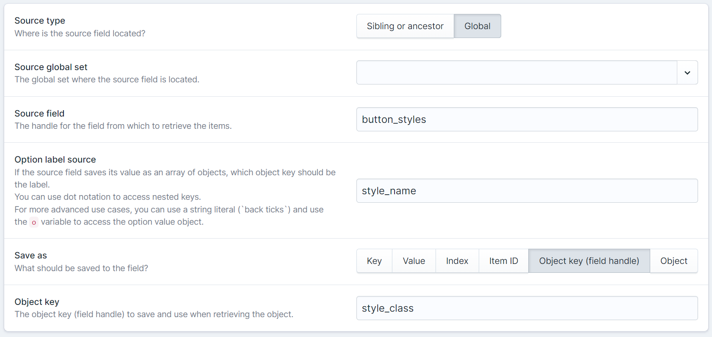

# Statamic Field Item Relationship

A Statamic plugin that adds a Field Item Relationship fieldtype.<br>
With Field Item Relationship you can select a value from a source fields' items.
That source field could be a sibling or ancestor field (in the same blueprint), or come from a Global set.

## Installation

Install this plugin using composer.

```cli
composer require eminos/statamic-field-item-relationship
```

## Features

- The source field could be a sibling or ancestor field, or come from a Global set.
- Set which key/field should be used as the select option label.
- Use string literal for advanced option label configuration (see [screenshot #4](#screenshot-4))
- Choose what you want to save as the selected item.
  - Key/Index
  - Specified object key
  - Full item/object
- Comes with a Tag `{{ fir }}` to help you fetch the selected source field item.

## Field configuration

The field configuration will depend on the source field data type.<br>
Depending on if the source data is a simple array of strings, an array of objects or an individual object, different "Save as" options will be possible.

You will get a warning message in the field if the field configuration isn't compatible with the source field data.

## Tag usage

This fetches the source value from the configured source field in field "field_item_relationship_field".
```html
{{ fir:field_item_relationship_field }}
```

If the source value is an object you get its values like this.
```html
{{ fir:field_item_relationship_field }}
    {{ text_field_1 }}
    {{ some_other_field }}
{{ /fir:field_item_relationship_field }}
```

Or by specifying the target field in the tag like this:
```html
{{ fir:field_item_relationship_field:text_field_1 }}
```

Even nested fields work, like this:
```html
{{ fir:field_item_relationship_field:some_field.child_field }}
```

You can also get Global fields:
```
{{ fir:global_set:field_item_relationship_field:nested.target.path }}
```

An other way is to use the field and path parameters:
```
{{ fir field="global_set:field_item_relationship_field" path="some_field.child_field" }}
```

## Screenshots

A few different examples.


A real life example with the source field being in a Global set.


The field configuration options.


<div id="screenshot-4"></div>

Advanced option label configuration.


## Possible improvements

- Multiselect
- More selection fieldtype options (in addition to the Select fieldtype)

## License

The MIT License (MIT). Please see [License File](LICENSE.md) for more information.